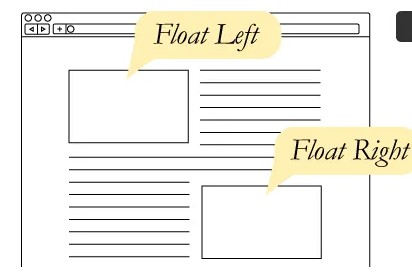
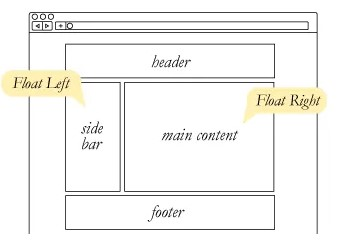
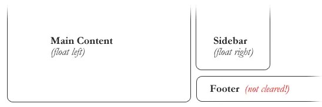
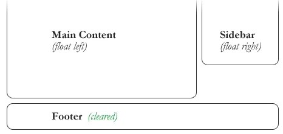

# RESPONSIVE WEB DESIGN and FLOATS

1. Responsive vs. Adaptive vs. Mobile

Responsive and adaptive web design are closely related, and often transposed as one in the same.
Responsive generally means to react quickly and positively to any change, while adaptive means to be easily modified for a new purpose or situation.
responsive design websites continually and fluidly change based on different factors, such as viewport width, while adaptive websites are built to a group of preset factors.

Mobile, on the other hand, generally means to build a separate website commonly on a new domain solely for mobile users. While this does occasionally have its place, it normally isn’t a great idea.
Mobile websites can be extremely light but they do come with the dependencies of a new code base and browser sniffing, all of which can become an obstacle for both developers and users.

2. Flexible Layouts

Responsive web design is broken down into three main components, including :
A. Flexible layouts

is the practice of building the layout of a website with a flexible grid, capable of dynamically resizing to any width (built using relative length units).
These relative lengths are then used to declare common grid property values such as width, margin, or padding.

# Flexible Grid

Let’s see how this formula works inside of a two column layout.

HTML

div class="container"
  section...section
  aside...aside
div

CSS

.container {
  width: 538px;
}
section,
aside {
  margin: 10px;
}
section {
  float: left;
  width: 340px;
}
aside {
  float: right;
  width: 158px;
}

section,
aside {
  margin: 1.858736059%; /*  10px ÷ 538px = .018587361 */
}
section {
  float: left;
  width: 63.197026%;    /* 340px ÷ 538px = .63197026 */   
}
aside {
  float: right;
  width: 29.3680297%;  /* 158px ÷ 538px = .293680297 */
}

B- Media queries

Media queries were built as an extension to media types commonly found when targeting and including styles. Media queries provide the ability to specify different styles for individual browser and device circumstances.

# Initializing Media Queries

There are a couple different ways to use media queries, using the @media rule inside of an existing style sheet, importing a new style sheet using the @import rule, or by linking to a separate style sheet from within the HTML document.

Each media query may include a media type followed by one or more expressions. Common media types include all, screen, print, tv, and braille. The HTML5 specification includes new media types, even including 3d-glasses.

# Logical Operators in Media Queries

Logical operators in media queries help build powerful expressions. There are three different logical operators available for use within media queries, including :
1. and

Using the and logical operator within a media query allows an extra condition to be added

@media all and (min-width: 800px) and (max-width: 1024px) {...}

2. not

The not logical operator negates the query, specifying any query but the one identified

@media not screen and (color) {...}

3. only

The only logical operator is a new operator and is not recognized by user agents using the HTML4 algorithm

@media only screen and (orientation: portrait) {...}

NOTE : When using the not and only logical operators the media type may be left off. In this case the media type is defaulted to all.

The height and width may be found by using the height and width media features. Each of these media features may then also be prefixed with the min or max qualifiers, building a feature such as min-width or max-width.
The height and width features are based off the height and width of the viewport rendering area

@media all and (min-width: 320px) and (max-width: 780px) {...}

# FLOAT

# What is “Float”?
Float is a CSS positioning property. To understand its purpose and origin, we can look to print design. In a print layout, images may be set into the page such that text wraps around them as needed.

In page layout programs, the boxes that hold the text can be told to honor the text wrap, or to ignore it. Ignoring the text wrap will allow the words to flow right over the image like it wasn’t even there. This is the difference between that image being part of the flow of the page.

There are four valid values for the float property. Left and Right float elements those directions respectively. None (the default) ensures the element will not float and Inherit which will assume the float value from that elements parent element.

#sidebar {
  float: right;			
}

# What are floats used for?

Aside from the simple example of wrapping text around images, floats can be used to create entire web layouts.

Floats are also helpful for layout in smaller instances.

# Clearing the Float

Float’s sister property is clear. An element that has the clear property set on it will not move up adjacent to the float like the float desires, but will move itself down past the float.
without clear

with clear

#footer {
  clear: both;			
}

Clear has four valid values as well. Both is most commonly used, which clears floats coming from either direction. Left and Right can be used to only clear the float from one direction respectively. None is the default, which is typically unnecessary unless removing a clear value from a cascade. Inherit would be the fifth, but is strangely not supported in Internet Explorer. Clearing only the left or right float, while less commonly seen in the wild, definitely has its uses.

# The Great Collapse

One of the more bewildering things about working with floats is how they can affect the element that contains them
As anti-intuitive as collapsing seems to be, the alternative is worse.
Collapsing almost always needs to be dealt with to prevent strange layout and cross-browser problems. We fix it by clearing the float after the floated elements in the container but before the close of the container.