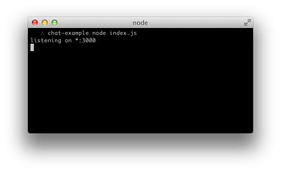
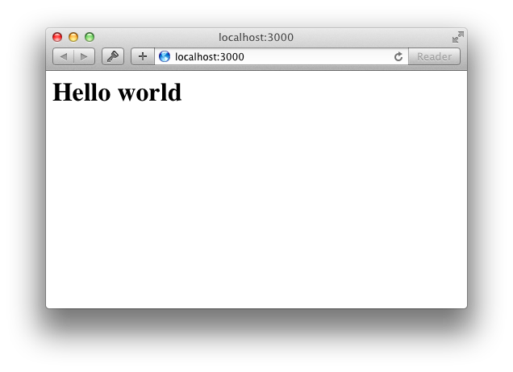

# Message Queues

the server can push messages to clients. Whenever you write a chat message, the idea is that the server will get it and push it to all other connected clients.

## The web framework

1. set up a simple HTML webpage that serves out a form and a list of messages. We’re going to use the Node.JS web framework express to this end. Make sure Node.JS is installed.

2. create a package.json be 

npm init -y

3. install the package that required like express

npm install express

4. create the file index.js and start the code :

const express = require('express');
const app = express();
const http = require('http');
const server = http.createServer(app);

app.get('/', (req, res) => {
  res.send('<h1>Hello world</h1>');
});

server.listen(3000, () => {
  console.log('listening on *:3000');
});

that mean :

A. Express initializes app to be a function handler that you can supply to an HTTP server.

B. We define a route handler / that gets called when we hit our website home.

C. We make the http server listen on port 3000.

5. if you run the node index.js you should see 

that mean the server listen for the prot 3000 and if you go for the browser and put
http://localhost:3000

it will go for the route home

6. now we want to create the HTML and make the app run this page and listen for it make inside it the form chat the client will put all the text and chat inside this box

A. first in the index.js you will create the path for it:

app.get('/', (req, res) => {
  res.sendFile(__dirname + '/index.html');
});

B. inside the index.html you will create the basic and the from for the message to appear in the page

!DOCTYPE html>

html>

 head>

    title>Socket.IO chat</title>

    style>

      body { margin: 0; padding-bottom: 3rem; font-family: -apple-system, BlinkMacSystemFont, "Segoe UI", Roboto, Helvetica, Arial, sans-serif; }

      #form { background: rgba(0, 0, 0, 0.15); padding: 0.25rem; position: fixed; bottom: 0; left: 0; right: 0; display: flex; height: 3rem; box-sizing: border-box; backdrop-filter: blur(10px); }
      #input { border: none; padding: 0 1rem; flex-grow: 1; border-radius: 2rem; margin: 0.25rem; }
      #input:focus { outline: none; }
      #form > button { background: #333; border: none; padding: 0 1rem; margin: 0.25rem; border-radius: 3px; outline: none; color: #fff; }

      #messages { list-style-type: none; margin: 0; padding: 0; }
      #messages > li { padding: 0.5rem 1rem; }
      #messages > li:nth-child(odd) { background: #efefef; }

    </style>
  </head>

  <body>

    <ul id="messages"></ul>

    <form id="form" action="">

      <input id="input" autocomplete="off" /><button>Send</button>

    </form>

  /body>

/html>

## Rooms

A room is an arbitrary channel that sockets can join and leave. and the rome mean the server-only.

## Default room

Each Socket in Socket.IO is identified by a random, unguessable, unique identifier Socket#id. For your convenience, each socket automatically joins a room identified by its own id.

## Room events

the underlying Adapter will emit the following events:

create-room (argument: room)
delete-room (argument: room)
join-room (argument: room, id)
leave-room (argument: room, id)