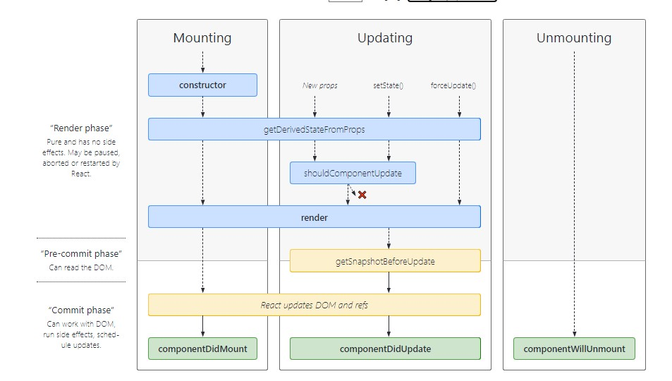

# Component Composition

Composition is communication between two component and make your code more smaller and clean and rideable, you will not repeat the code in any two page or file a gain and a gain.

# The Component Lifecycle

1. Mounting

it will go with the constructor first and then go to componentDidMount

2. Updating

it will go first with constructor then to getDerivedStateFromProps then to render  the page and continue componentDidMount

3. Unmounting

it will go directly to componentWillUnmount

