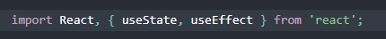

# HOOK

HOOK is a special function that lets you hook into React features.

Example : useState ===>>>> is hook that lets you add React state to function components.

## when would i use a HOOK ????

if you write a function component and realized you need to add some state to it and the perviously you had to convert it to a class.

so now you can use a HOOK inside the existing function component.

in the class component you write you code like this:

but now with the HOOK you it will make your code more clean and more rideable 

## what does calling useState does???

useState it will make you call the variable when you want to base and callback and use the value for it just like use the variable without anything just like (count) but in the class it like the object one you will base for it (this.state.count) to have the value and callback.

## what do we pass to useState as an argument???

you can pass anything you want to use like string, number, boolean, array anything you want and want to the value reference for it.

## Effect HOOK

Effect HOOK it like the componentDidMount but you can using it more thant once as you want and can make inside it function to render for you some effect in your page.

you will declare it in the beginning of the page with the React and useState it will call useEffect like this

